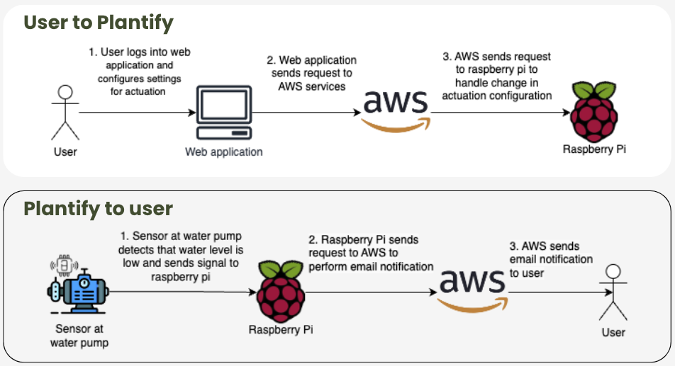
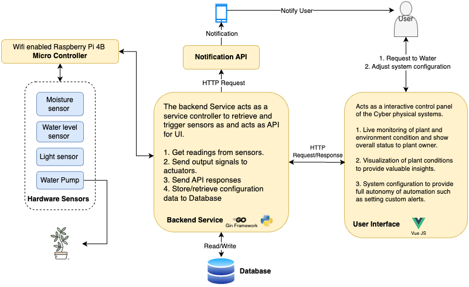
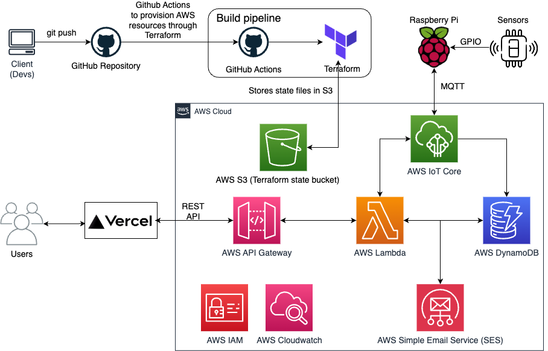

# cs460_g2_t4

## Plantify Overview
Plantify is an innovative Cyber Physical System (CPS) designed to revolutionize the way we care for plants, catering to the needs of busy individuals, particularly those with full-time jobs or busy lifestyles. 

The system, enable users to effortlessly maintain healthy and thriving indoor and outdoor plants while optimizing resource consumption.

## Objectives of plantify: 
1. Simplify Plant Care
2. Remote Monitoring
3. Automated Care
4. Resource Efficiency

#### Project Scope - Plantify for a single user
<b><u>Scalable</u></b> design to accomodate more plants if necessary for a single or more users​
- <b>Data collection:</b> Data collection from sensors to be stored in our database
- <b>Actuation:</b> Automated actuation to dispense water into the plant’s soil
- <b>Email notifications</b> Email notifications are sent once the water pump level reaches a certain threshold 
- <b>Configurability:</b> Users are able to configure settings such as how much water to dispense and treshold
- <b>Dashboard:</b> Dashboard for users to gain insights on how is their plant doing. E.g, water consumption

#### Design considerations
##### User-Centric
• Ensuring the system is user-friendly with good usability.
• Users have full control over parameters e.g. volume of water, etc.
##### Sensors
• Consider using reliable, durable, waterproofed sensors since they will be exposed to the environment
• Device security using lockbox to prevent tampering of sensitive hardware
• Data security at rest and in transit - X.509 certificates generated by AWS loT
Core
##### Power Efficiency
• Optimise power consumption to prolong lifespan of system
• Strategic placement for available portable power source to ensure system is operational 24/7 and to cater for hanging plants
##### Weather Considerations
• Account for variations in weather conditions which might impact watering schedule

#### High process flows

#### System Architecture diagram

#### AWS Architecture diagram

## Building the infrastructure
Follow the guide in the [Infrastructure](terraform/README.md) file to build the infrastructure.
